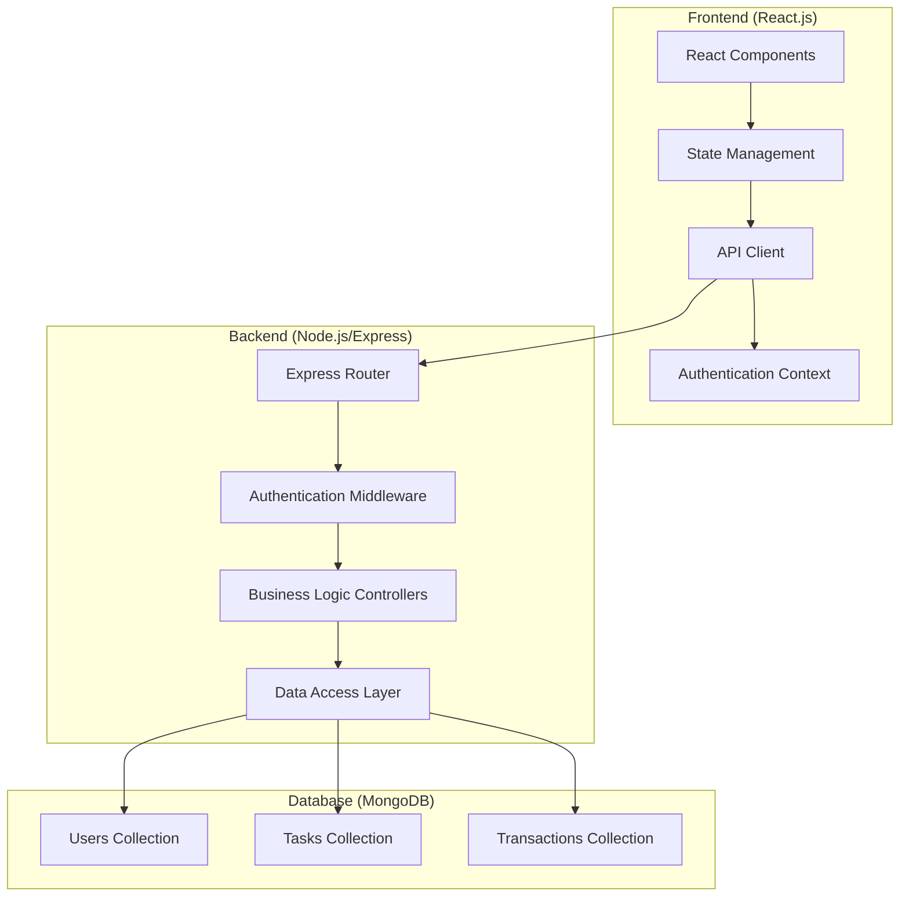
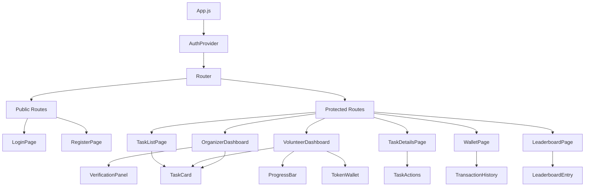

# Design Document

## Overview

The Event-Based Volunteer Reward System is architected as a modern full-stack web application using React.js for the frontend and Node.js with Express.js for the backend. The system employs a RESTful API architecture with JWT-based authentication, MongoDB for data persistence, and a component-based React frontend with state management for real-time updates.

The application follows a three-tier architecture pattern:
- **Presentation Layer**: React.js components with responsive design
- **Business Logic Layer**: Node.js/Express.js API with middleware for authentication and validation
- **Data Layer**: MongoDB with Mongoose ODM for schema management

## Architecture

### System Architecture Diagram



### Technology Stack

**Frontend:**
- React.js 18+ with functional components and hooks
- React Router for client-side routing
- Axios for HTTP requests
- Context API for global state management
- CSS Modules or Styled Components for styling
- React Hook Form for form management

**Backend:**
- Node.js with Express.js framework
- JWT for authentication tokens
- bcrypt for password hashing
- Mongoose ODM for MongoDB interaction
- express-rate-limit for API rate limiting
- cors for cross-origin resource sharing
- helmet for security headers

**Database:**
- MongoDB for document storage
- Mongoose for schema validation and relationships

## Components and Interfaces

### Frontend Component Architecture



### Core React Components

**Authentication Components:**
- `AuthProvider`: Context provider for authentication state
- `ProtectedRoute`: Route wrapper for authenticated access
- `LoginForm`: User login interface
- `RegisterForm`: User registration with role selection

**Dashboard Components:**
- `OrganizerDashboard`: Task management and verification interface
- `VolunteerDashboard`: Available tasks and personal progress
- `StatsDisplay`: User statistics and progress indicators

**Task Components:**
- `TaskCard`: Individual task display with actions
- `TaskList`: Filterable list of tasks
- `TaskForm`: Task creation form for organizers
- `VerificationPanel`: Task verification interface

**Gamification Components:**
- `ProgressBar`: Visual progress indicators
- `TokenWallet`: Token balance and transaction display
- `LeaderboardEntry`: Individual leaderboard item
- `LevelBadge`: User level indicator

### Backend API Structure

**Authentication Routes:**
```javascript
POST /api/auth/register
POST /api/auth/login
GET /api/auth/profile
POST /api/auth/logout
```

**Task Management Routes:**
```javascript
GET /api/tasks              // Get filtered tasks
POST /api/tasks             // Create task (organizer only)
GET /api/tasks/:id          // Get specific task
PUT /api/tasks/:id/assign   // Assign task to volunteer
PUT /api/tasks/:id/complete // Mark task complete
PUT /api/tasks/:id/verify   // Verify task completion
DELETE /api/tasks/:id       // Delete task (organizer only)
```

**User Management Routes:**
```javascript
GET /api/users/dashboard    // User dashboard data
GET /api/users/wallet       // Token wallet information
GET /api/users/leaderboard  // Leaderboard data
PUT /api/users/profile      // Update user profile
```

**Transaction Routes:**
```javascript
GET /api/transactions       // User transaction history
POST /api/transactions/redeem // Redeem tokens
```

## Data Models

### User Schema
```javascript
const userSchema = {
  _id: ObjectId,
  email: { type: String, required: true, unique: true },
  password: { type: String, required: true }, // bcrypt hashed
  role: { type: String, enum: ['organizer', 'volunteer'], required: true },
  username: { type: String, required: true, unique: true },
  level: { type: String, enum: ['beginner', 'intermediate', 'advanced'], default: 'beginner' },
  totalTokens: { type: Number, default: 0 },
  tasksCompleted: { type: Number, default: 0 },
  createdAt: { type: Date, default: Date.now },
  updatedAt: { type: Date, default: Date.now }
}
```

### Task Schema
```javascript
const taskSchema = {
  _id: ObjectId,
  title: { type: String, required: true },
  description: { type: String, required: true },
  difficulty: { type: String, enum: ['easy', 'intermediate', 'difficult'], required: true },
  tokenReward: { type: Number, required: true }, // Auto-set based on difficulty
  createdBy: { type: ObjectId, ref: 'User', required: true },
  status: { type: String, enum: ['open', 'in_progress', 'completed', 'verified', 'expired'], default: 'open' },
  assignedTo: { type: ObjectId, ref: 'User' },
  completedAt: Date,
  verifiedAt: Date,
  deadline: { type: Date, required: true },
  createdAt: { type: Date, default: Date.now },
  updatedAt: { type: Date, default: Date.now }
}
```

### Transaction Schema
```javascript
const transactionSchema = {
  _id: ObjectId,
  userId: { type: ObjectId, ref: 'User', required: true },
  taskId: { type: ObjectId, ref: 'Task' },
  tokensEarned: { type: Number, required: true },
  transactionType: { type: String, enum: ['earned', 'redeemed'], required: true },
  timestamp: { type: Date, default: Date.now },
  blockchainTxHash: String, // Placeholder for future blockchain integration
  description: String
}
```

## Error Handling

### Frontend Error Handling Strategy

**API Error Handling:**
- Centralized error interceptor in Axios configuration
- User-friendly error messages for common HTTP status codes
- Retry mechanisms for network failures
- Loading states during API calls

**Form Validation:**
- Real-time validation using React Hook Form
- Custom validation rules for business logic
- Clear error messaging for each field
- Prevention of duplicate submissions

**Authentication Errors:**
- Automatic token refresh handling
- Redirect to login on authentication failures
- Clear session on token expiration

### Backend Error Handling Strategy

**Middleware Error Handler:**
```javascript
const errorHandler = (err, req, res, next) => {
  // Log error details
  console.error(err.stack);
  
  // Determine error type and response
  if (err.name === 'ValidationError') {
    return res.status(400).json({ error: 'Validation failed', details: err.errors });
  }
  
  if (err.name === 'UnauthorizedError') {
    return res.status(401).json({ error: 'Authentication required' });
  }
  
  // Generic server error
  res.status(500).json({ error: 'Internal server error' });
};
```

**Input Validation:**
- Joi or express-validator for request validation
- Sanitization of user inputs
- Rate limiting to prevent abuse
- CORS configuration for security

## Testing Strategy

### Frontend Testing

**Unit Testing:**
- Jest and React Testing Library for component testing
- Test user interactions and state changes
- Mock API calls for isolated testing
- Test authentication flows and protected routes

**Integration Testing:**
- Test complete user workflows
- API integration testing with mock backend
- Form submission and validation testing

**E2E Testing:**
- Cypress for end-to-end user scenarios
- Test complete task creation and completion workflows
- Authentication and authorization flows
- Cross-browser compatibility testing

### Backend Testing

**Unit Testing:**
- Jest for testing individual functions and middleware
- Mock database operations for isolated testing
- Test authentication and authorization logic
- Validate business rules and calculations

**Integration Testing:**
- Supertest for API endpoint testing
- Test database operations with test database
- Test authentication middleware integration
- Validate complete request/response cycles

**Database Testing:**
- MongoDB Memory Server for testing
- Test schema validation and relationships
- Test data integrity and constraints

### Performance Testing

**Frontend Performance:**
- React DevTools Profiler for component performance
- Lighthouse audits for web vitals
- Bundle size analysis and optimization

**Backend Performance:**
- Load testing with Artillery or similar tools
- Database query optimization
- API response time monitoring

## Security Considerations

### Authentication Security
- JWT tokens with appropriate expiration times
- Secure HTTP-only cookies for token storage (optional)
- Password strength requirements and validation
- Account lockout after failed login attempts

### API Security
- Rate limiting on all endpoints
- Input validation and sanitization
- CORS configuration for allowed origins
- Helmet.js for security headers
- SQL injection prevention through Mongoose

### Data Protection
- bcrypt for password hashing with salt rounds
- Environment variables for sensitive configuration
- HTTPS enforcement in production
- Data validation at multiple layers

## Deployment Architecture

### Development Environment
- Local MongoDB instance or MongoDB Atlas
- Node.js development server with hot reload
- React development server with hot module replacement
- Environment-specific configuration files

### Production Environment
- MongoDB Atlas or managed MongoDB instance
- Node.js application server (PM2 for process management)
- React build served through Express static middleware or CDN
- Load balancer for high availability
- SSL/TLS certificates for HTTPS

### Environment Configuration
```javascript
// Environment variables
NODE_ENV=production
PORT=3000
MONGODB_URI=mongodb://localhost:27017/reward-system
JWT_SECRET=your-secret-key
JWT_EXPIRE=24h
BCRYPT_ROUNDS=12
```

This design provides a solid foundation for implementing the event-based reward system with scalability, security, and maintainability in mind. The modular architecture allows for future enhancements including blockchain integration and additional gamification features.